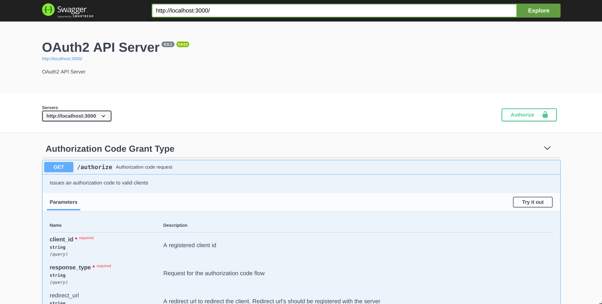

[](https://travis-ci.org/ngendah/oauth2-proto-server)
[](https://codeclimate.com/github/ngendah/oauth2-proto-server/maintainability)
[](https://codeclimate.com/github/ngendah/oauth2-proto-server/test_coverage)
[](https://hakiri.io/github/ngendah/oauth2-proto-server/master)

OAuth 2 protocol server 
=======================
A modular and extensible OAuth2 server.

It implements the following grants:
* authorization code with PKCE
* user credentials
* implicit

### Getting Started
OAuth2 server uses [swagger-ui](https://github.com/swagger-api/swagger-ui) to generate its documentation 
and make it easier to get started. The only dependency required is [docker-compose](https://docs.docker.com/compose/).

1. Build and run the app,
   ```
    $ docker-compose up
   ```
2. On your browser navigate to `localhost:8080` to access `swagger-ui`.

3. Reference documents are available at `docs/auth-code`, `docs/user-cred` and `docs/implicit`.

Seed values for the development server are available [here](./db/seeds.rb)

## OAuth 2.0 Reference
[Framework](https://tools.ietf.org/html/rfc6749)

[Token revocation](https://tools.ietf.org/html/rfc7009)

[Token introspection](https://tools.ietf.org/html/rfc7662)

[Proof key for code exchange (PKCE)](https://tools.ietf.org/html/rfc7636)

[Security considerations](https://tools.ietf.org/html/rfc6819)
